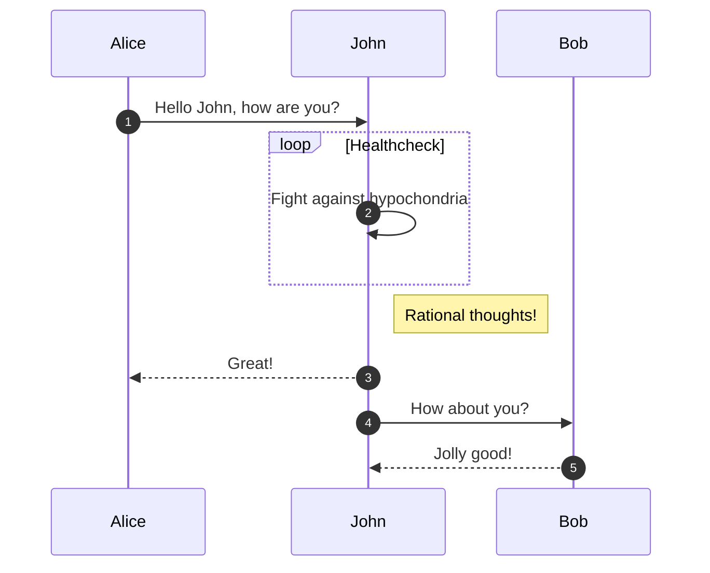
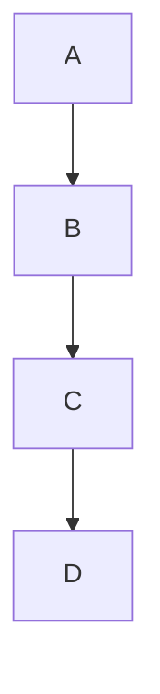

# Making this application a streamlit app

1. Make basic struct of
```
    - requirements.txt
    - citation.cff
    - app dir
    - app/static dir
```

2. Add a basic streamlit app to app dir
- app/home.py
```
import streamlit as st
st.set_page_config(
        page_title="good-practice",
        page_icon="app/static/good.png",
        layout="wide",
    )
st.header("Research Software Good Practice")
```

3. Put an icon in the static dir
- app/static/good.png
This is simply good practice to check paths and file names and looks better. Streamlit doesn't require the ico format.

4. Make a virtual environment
```bash
python3 -m venv venv
source venv/bin/activate # linux
venv\Scripts\activate # windows
```

5. Install the requirements
```bash
pip install -r requirements.txt
```

6. Run the streamlit app
```bash
streamlit run app/home.py
```

7. Find a very rough example to work with and add it to the streamlit app
- app/home.py
Make sure to track the references for the code snippets.
https://stackoverflow.com/questions/25148462/open-a-url-by-clicking-a-data-point-in-plotly

# Additional imports compared with above example:
import math
import plotly.express as px
import pandas as pd

df = px.data.gapminder().query("year==2007 and continent=='Asia'")
fig = px.scatter(df, x="gdpPercap", y="lifeExp", color="lifeExp", \
                 size="pop", log_x=True, size_max=60)

fig.update_layout(
    height=800,width=1200,
    title_text='GDP and Life Expectancy (Asia, 2007)'
)
for idx in df.index:
    url="<a href='https://en.wikipedia.org/wiki/Demographics_of_"+df['country'][idx]+"' target='_blank'>"+df['country'][idx]+"</a>"
    fig.add_annotation(dict(x=math.log10(df['gdpPercap'][idx]),
                            y=df['lifeExp'][idx],
                            showarrow=False,
                            text=url,
                            xanchor='auto',
                            yanchor='auto'))
fig.show()


8. Design a basic dataframe to use for a similar example
It needs
    - a name, which we can use to make the url, 
    - a level, eg beginners etc
    - a position on the chart
    - a type for the hue
```
resource,level,position,kind
good-practice-intro,0,0,doc
python-lib-example",1,1.1,follow-along
python-streamlit-example,1,1.2,follow-along
r-lib-example,1,2.1,follow-along
r-shiny-example,1,2.2,follow-along
vscode-intro",0,3,tools
python-for-hpc,3,1.3,doc
```


9. Add this example to the streamlit app


10. Add a basic test to the app dir


11. Move the plt to a page with pages


12. Update necessary tests


13. Set up the branch safety in guthub

Deployment option 1
14. Create a dockerfile and build the docker image

15. Test the docker image


15. Add the github actions to build the docker image


16. Deploy the docker image to ICR


Deployment option 2
14. Create a  streamlit account

15. Deploy to streamlit


3. Add a basic test to app dir
4. Add a basic setup.py to app dir
5. Add a basic README.md to app dir
6. Add a basic LICENSE to app dir
7. Add a basic .gitignore to app dir
8. Add a basic .dockerignore to app dir
9. Add a basic Dockerfile to app dir
10. Add a basic .github/workflows to app dir


::: warning
*here be dragons*
:::

> [!EXAMPLE]
> this is an example

> [!NOTE]
> This is a note

> [!NOTE]
> Beside results initiated by a command (synchronous) you can get asynchronous results initiated by rule trigger, telemetry event, commands from other source or changed device values.    
Simply put, other messages may precede messages published as a result of your commands.

> [!EXAMPLE] A `tele/%topic%/STATUS` message (sent every 300 seconds by default) may appear exactly after you issue `Power off` command and before you receive `stat/%topic%/RESULT = {"POWER":"OFF"}` message.


https://squidfunk.github.io/mkdocs-material/reference/diagrams/

``` mermaid
graph LR
  A[Start] --> B{Error?};
  B -->|Yes]| C[Hmm...];
  C --> D[Debug];
  D --> B;
  B ---->|No| E[Yay!];
```



